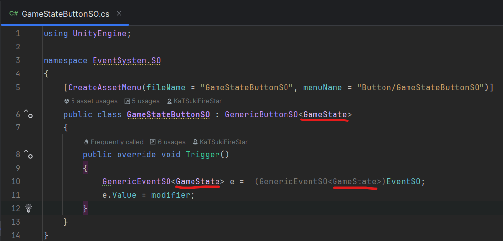

# Event System Documentation

This package contains an event system made for unity. This event system is based on the design pattern Observer and on the Scriptable Obejct of unity.

# How to use the Event System

## Import the template

In order to use this event system, you can start by import the template for the different script and create the different event and trigger more faster.

In order to import it, go in the sample of the package and import the Event System Templates.
After that restart your unity.

## Use the Event System

### Create the different script

The first thing to do in order to use the event system is to create some script for the different Scriptable Object.
In order to help you, use the different template import previously.
You can find it in the same menu as the other script/material/… than usual.

Create a generic event so and name it.
After that, you must open it and change the type of the script.

Now, you can also create a new generic trigger so.
As like as the generic event, you must change the type.

### Create the Scriptable Object

The next step is to create your different scriptable object.
The first one you must create is you event.

Just after the creation of your event. You can create a trigger.
The trigger can help you but aren't an obligation.
This can be used when your event will have some predefined value.

After the creation, you must specify the information in the inspector.

### Use your event and trigger

Now, you can import your event and trigger in your different script.

Now, create a subscription for your event.

Now, this method will be called each time the events value change.
In order to change the event value, you can use two different way:
- Use the trigger and set the events with the wanted events and set the modifier
- Change directly the value of the event

